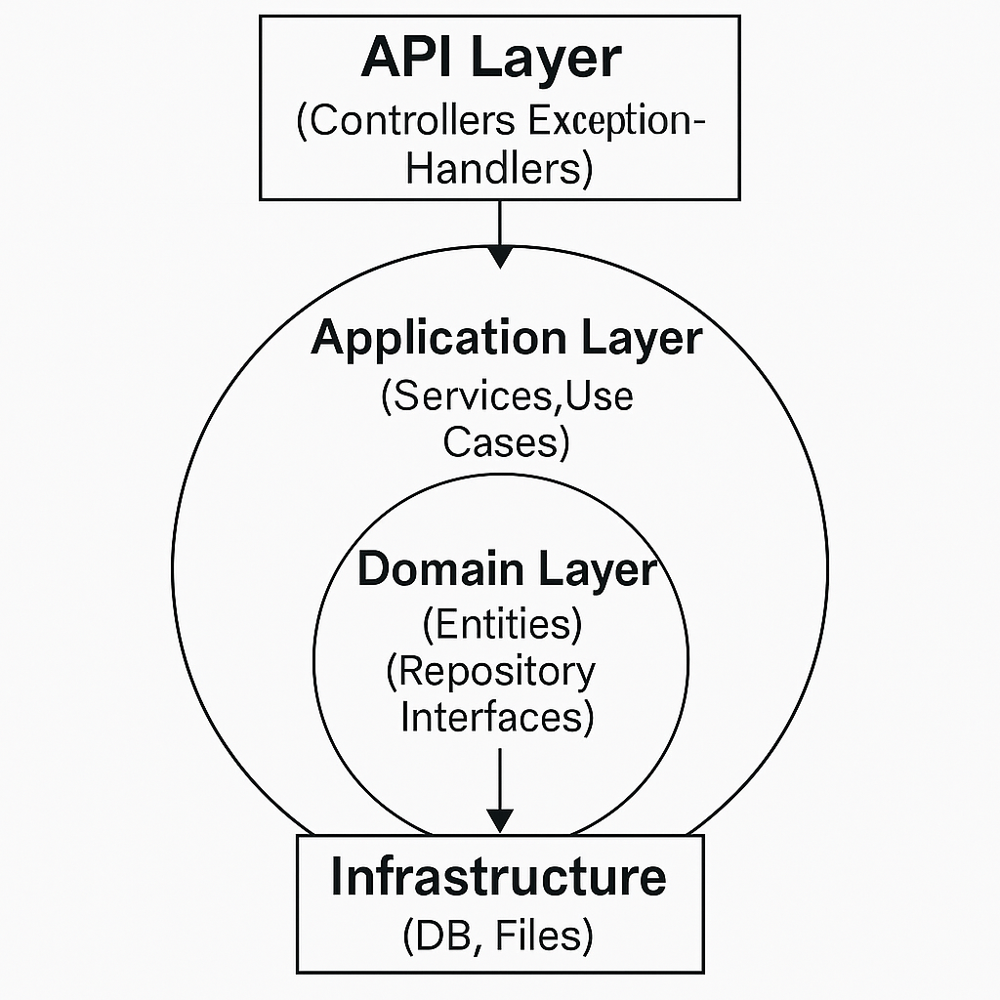

## SpringCleanArch


[](https://github.com/vijayagopalsb/SpringCleanArch/actions)


SpringCleanArch is a demonstration project showing how to implement Clean Architecture principles using Java and Spring Boot.  
It provides a RESTful API for managing users and roles, supports file (photo) uploads, and features robust error handling and logging.

**Key Features:**
- User registration, update, delete, and fetch
- Assign single or multiple roles to users
- Prevent duplicate entries (unique email constraint)
- Upload and serve user profile photos
- Clean and robust error handling
- Extensible, maintainable, and testable structure

###  Clean Architecture Compliance

SpringCleanArch applies **Clean Architecture**

#### Principles

- **Independent of Frameworks**: Core logic is decoupled from frameworks.
- **Testable**: Business rules can be tested without UI, database, or web server.
- **Pluggable Interfaces**: UI, DB, and external interfaces are plug-ins.
- **Dependency Rule**: Source code dependencies always point inward, toward the core domain.

#### Project Structure

```bash
SpringCleanArch/
├── .mvn/                  # Maven wrapper files
├── logs/                  # Application logs
├── uploads/               # Directory for uploaded files (e.g., user photos)
├── src/
│   └── main/
│       └── java/
│           └── com/
│               └── example/
│                   └── app/
│                       ├── api/                 # REST Controllers
│                       │   ├── exceptions/      # Custom exceptions and handlers
│                       │   └── UserController.java
│                       ├── application/         # Business logic (Use Cases)
│                       │   └── UserService.java
│                       ├── domain/              # Core domain models and interfaces
│                       │   ├── AppUser.java
│                       │   ├── Role.java
│                       │   ├── repository/      # Repository interfaces
│                       │   │   ├── UserRepository.java
│                       │   │   └── RoleRepository.java
│                       ├── infrastructure/      # Implementations of interfaces
│                       │   ├── JpaUserRepository.java
│                       │   └── JpaRoleRepository.java
│                       └── SpringCleanArchApplication.java  # Main application entry point
├── .gitignore
├── mvnw
├── mvnw.cmd
├── pom.xml                # Maven project configuration
└── README.md
```

- **Entities**: `domain/`
- **Use Cases**: `application/`
- **Interfaces & Adapters**: `api/`, `infrastructure/`
- **Dependencies**: Outermost layers depend inward; no circular dependencies.

#### Spring Framework Usage

- **Dependency Injection**: Uses `@Service`, `@Repository`, constructor injection.
- **Exception Handling**: Custom exceptions and `@ControllerAdvice` for error handling.
- **Spring Data JPA**: Repositories defined as interfaces in domain, implemented in infrastructure.
- **File Upload/Download**: Uses `MultipartFile` and static resource handling.
- **Logging**: Uses SLF4J (`LoggerFactory`) throughout.

#### Testability & Extensibility

- **Testability**: Application and domain layers can be tested independently (mock repositories).
- **Extensibility**: New use cases, data sources, or APIs can be added without breaking core logic.

#### Code Quality & Readability

- Clean, well-structured, and readable code.
- Consistent and clear REST API endpoints.
- Good logging and meaningful error responses.
- Modular, idiomatic Java & Spring Boot style.

#### Improvements & Suggestions

To make the project even more impressive:
- **Add Unit Tests**: Include tests for application/domain layers (JUnit, Mockito).
- **Expand Documentation**: 
    - Add an overview of the architecture and a diagram.
    - Include sample API requests/responses.
- **DTO Layer**: Add DTOs to decouple API and domain models.
- **Validation**: Use `@Valid` for request body validation.

#### API Endpoints

- `POST   /users`           — Create a new user
- `GET    /users/{id}`      — Get user by ID
- `PUT    /users/{id}`      — Update user details
- `DELETE /users/{id}`      — Delete user
- `POST   /users/{id}/roles`      — Assign a role to user
- `POST   /users/{id}/roles/bulk` — Assign multiple roles to user
- `POST   /users/{id}/photo`      — Upload user photo
- `GET    /users/photos/{filename}` — Get user photo by filename

#### Clean Architecture Explained

**Clean Architecture**

This project follows Clean Architecture principles, which emphasize the separation of concerns and independence of business logic from frameworks or external systems.


<p align="center">
  
</p>

**Layers**

- Domain Layer: Core business logic. Contains entity classes (e.g., AppUser, Role) and repository interfaces (UserRepository, RoleRepository).
No dependencies on Spring or infrastructure code.


- Application Layer: Implements use cases and orchestrates business rules (UserService). Uses only interfaces from the Domain layer.


- API Layer: Contains Spring REST controllers (UserController) and exception handlers. Handles HTTP requests/responses and delegates business logic to the Application layer.


- Infrastructure Layer: Provides technical implementations such as database access (JpaUserRepository, JpaRoleRepository), file storage, etc.


**Dependency Direction:**
- All dependencies point inward. The innermost layer (Domain) is independent of any frameworks or external tools.


